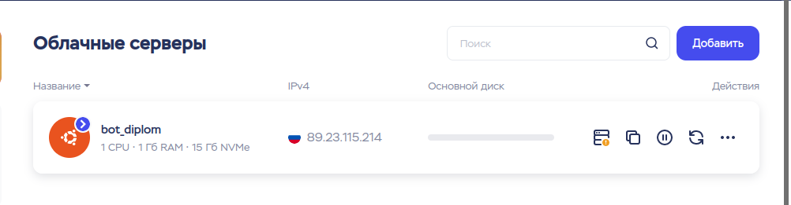

# Дипломный проект
## Студент Бурлаков Валерий
### группа - 3508&3370

## Информация о проекте(Тема)
    Реализация системы контроля для личной коллекции монет через телеграм бота
    @IAmManBot
## Цель:
    изучить процессы взаимодействия базы данных MYSQL, библиотеки Aiogram и языка программирования Python
## Задачи

1. Запустить свой сервер.
    * 1.1 Найти сервис, предоставляющий в аренду облачный сервер с ОС Ubuntu 22.04
    * 1.2 Подключение к серверу по ssh
    * 1.3 Установить все необходимые зависимости для реализации задачи
        * 1.3.1 ЯП Python 3.10
        * 1.3.2 СУБД MySQL
        * 1.3.3 FTP-клиент FileZilla, для файлообмена между моим компьютером и сервером
        * 1.3.4 Среда выполнения Node.js и модуль npm, для удобного управления процессом

2. Создать телеграм бота при помощи библиотеки aiogram и языка программирования Python.
   * 2.1 реализовать методы(хендлеры):
     * 2.1.1 Создание коллекции
     * 2.1.2 Удаление коллекции
     * 2.1.3 Добавление монеты в коллекцию
     * 2.1.4 удаление монеты из коллекции
     * 2.1.5 Просмотр коллекций и монет, находящихся в них
3. Создать виртуальное окружение для проекта.
    * 3.1 В Pycharm создается автоматически
4. Создать базу даных MySQL.
* 4.1 Реализовать грамотно таблицы для сущностей.

# Глава 1. Timeweb.cloud
### 1.1
* международная облачная платформа для бизнеса и частных лиц. 
* Ключевые возможности платформы: создание, управление и масштабирование 
* ИТ-инфраструктуры по всему миру, защищенное хранение данных, использование управляемых сервисов

### 1.2 Подключение к серверу по ssh
    * SSH - сетевой протокол прикладного уровня, позволяющий производить удалённое 
    * управление операционной системой и туннелирование TCP-соединений,
    * шифрует весь трафик, включая и передаваемые пароли.
    * Подключение к серверу пример имя пользователя и IP-адрес
        * ssh root@192.0.2.0
        * Вводим пароль gG-vR*?#fYS^c3
### 1.3 
#### 1.3.1
    * Проверить наличие ЯП Python версии 3.10
      * python3.10 --version
      * к счастью в моей ОС он предустановлен
#### 1.3.2
    * Установить MySQL
        * sudo apt install mysql-server
    * Запуск mysql.service
        * sudo systemctl start mysql.service
    * Заходим в mysql
        * sudo mysql
    * Проверяем метод аутентификации у нас сейчас auth_socket
        * SELECT user,authentication_string,plugin,host FROM mysql.user;
    * Меняем метод аутентификации на защищенный паролем
        * ALTER USER 'root'@'localhost' IDENTIFIED WITH caching_sha2_password BY 'q534Wp/5963!$';
    * Команда, которая просит сервер перезагрузить предоставленные таблицы и 
      ввести в действие изменения:
        * FLUSH PRIVILEGES;
    * Проверяем метод аутентификации теперь у нас caching_sha2_password                                       
        * SELECT user,authentication_string,plugin,host FROM mysql.user;       
    * При активированной аутентификации по паролю меняется команда аутентификации, вместо sudo mysql:
        * mysql -u root -p
        * вводим пароль
    * Создаем пользователя Valery
        CREATE USER 'Valery'@'localhost' IDENTIFIED BY '5345963qW!3/';
    * Прадоставляем нашему пользователю нужные права
        * GRANT ALL PRIVILEGES ON *.* TO 'Valery'@'localhost' WITH GRANT OPTION;
    * Проверим MySQL
        * systemctl status mysql.service
        * статус показывает Active: active (running) и горит зеленый круг
    * pip install mysql-connector-python
    * MySQL готов к работе
#### 1.3.3
    * Установка файлового менеджера FileZilla на личный компьютер
        * sudo apt-get install filezilla
    * проверка версии
        * filezilla --version
#### 1.3.4
    Менеджер процессов
    PM2 запускает приложения и скрипты в режиме 24/7 и 
    решает проблему с их вылетами путем автоматического перезапуска с сохранением лога. 
    Это решение особенно полезно для тех, кто держит на своем сервере большое количество 
    скриптов и нуждается в их удобном управлении.
    Так как PM2 написан на Node.js и устанавливается с помощью npm, 
    нужно установить их на свой виртуальный сервер:
        * sudo apt install nodejs
        * sudo apt install npm
    Установка самого менеджера:
        * npm install pm2 -g
    Запуск приложения через менеджер:
        * pm2 start app_name.py --interpreter=python3
    Список процессов:
        * pm2 list
    Остановка процесса:
        * pm2 stop id
    Запуск процесса:
        * pm2 start id
    Перезапуск процесса:
        * pm2 restart id
    Удалить процесс
        * pm2 delete id
    Просмотр логов приложений
        * pm2 monit
    Также напишем нкбольшой скрипт, который ежечасно перезапускает наше приложение
    Это сделано в связи с тем, что наш бот просто перестает работать через какое-то время

        module.exports = { 
          apps : [{
            name: 'my-python-app',
            script: 'main.py',
            cron_restart: '0 * * * *', // автоматический рестарт каждый час
            interpreter: 'python3'
          }]
        };

    запуск конфига
        * pm2 start ecosystem.config.js

# Глава 2. Мессенджер Телеграм, телеграм-бот, Язык программирования Python, База данных MySQL, библиотека Aiogram
### Мессенджер Телеграм:
    * кроссплатформенная система мгновенного обмена сообщениями
    * (мессенджер) с функциями обмена текстовыми, голосовыми и видеосообщениями, а т
    * акже стикерами, фотографиями и файлами многих форматов. 
    * Также можно совершать аудио и видеозвонки, устраивать трансляции в каналах и группах, 
    * организовывать конференции, многопользовательские группы и каналы. 
    * Функциональность приложения может быть значительно расширена при помощи ботов. 
    * Клиентские приложения Telegram доступны для Android, iOS, Windows, macOS и GNU/Linux. 
    * В июне 2022 года вошёл в пятёрку самых загружаемых приложений, 
    * а число его постоянных пользователей превысило 700 миллионов. 
    * По словам основателя сервиса Павла Дурова, на начало 2023 года 
    * Telegram стал вторым мессенджером в мире по популярности, уступив лишь WhatsApp. 

### Язык программирования Python
* Python — это язык программирования, который широко используется в интернет-приложениях, 
* разработке программного обеспечения, науке о данных и машинном обучении (ML). 
* Разработчики используют Python, потому что он эффективен, прост в изучении и 
* работает на разных платформах. Программы на языке Python можно скачать бесплатно, 
* они совместимы со всеми типами систем и повышают скорость разработки.

Python разработан Гвидо Ван Россумом (Guido Van Rossum), программистом из Нидерландов. 
    Он начал работу над языком в 1989 году в центре Centrum Wiskunde & Informatica (CWI). 
    Изначально язык был полностью любительским проектом: Ван Россум просто хотел чем-то 
    занять себя на рождественских каникулах. Название языка было взято из телешоу 
    BBC «Летающий цирк Монти Пайтона», большим поклонником которого являлся программист.

**Язык Python имеет следующие преимущества:**

    Разработчики могут легко читать и понимать программы на Python, поскольку язык имеет базовый синтаксис, 
    похожий на синтаксис английского. Python помогает разработчикам быть более продуктивными, 
    поскольку они могут писать программы на Python, используя меньше строк кода, чем в других языках.
    Python имеет большую стандартную библиотеку, содержащую многократно используемые коды 
    практически для любой задачи. В результате разработчикам не требуется писать код с нуля.
    Разработчики могут легко сочетать Python с другими популярными языками программирования: Java, C и C++.
    Активное сообщество Python состоит из миллионов поддерживающих разработчиков со всего мира. 
    При возникновении проблем сообщество поможет в их решении. Кроме того, в Интернете доступно 
    множество полезных ресурсов для изучения Python. Например, вы можете легко найти видеоролики, 
    учебные пособия, документацию и руководства для разработчиков.
    Python можно переносить на различные операционные системы: Windows, macOS, Linux и Unix.

**Автоматизация тестирования программного обеспечения**

    Тестирование программного обеспечения — это процесс проверки соответствия фактических результатов 
    программного обеспечения ожидаемым результатам, который позволяет убедиться, что программное 
    обеспечение не содержит ошибок.
    Разработчики используют среды модульного тестирования Python (Unittest, Robot и PyUnit) 
    для тестирования написанных функций. 
    Тестировщики программного обеспечения используют Python для написания тестовых примеров 
    для различных сценариев. Например, язык применяется для тестирования пользовательского 
    интерфейса интернет-приложения, нескольких программных компонентов и новых функций.
    Разработчики могут использовать несколько инструментов для автоматического запуска 
    тестовых скриптов. Эти инструменты известны как инструменты 
    непрерывной интеграции / непрерывного развертывания (CI/CD). 
    Тестировщики и разработчики программного обеспечения используют инструменты CI/CD (Travis CI и Jenkins) 
    для автоматизации процесса тестирования. Инструмент CI/CD автоматически запускает тестовые скрипты P
    ython и сообщает о результатах тестирования всякий раз, когда разработчики вносят новые изменения в код.

### БД MySQL
**MySQL** — свободная реляционная система управления базами данных (СУБД). 
Под словом «свободная» подразумевается ее бесплатность, под «реляционная» – работа с базами данных, 
основанных на двумерных таблицах. Система выпущена в 1995 году, её разработка активно продолжается.

У MySQL есть ряд преимуществ:

    Высокая скорость работы.
    Поддержка практически всех CMS.
    Бесплатная лицензия.
    Надежная и простая система безопасности.
    Поддержка нескольких типов таблиц: MyISAM, InnoDB.
    Плагины, позволяющие упростить и настроить работу под себя.
    В одной таблице может содержаться несколько миллионов записей.
    MySQL универсальна и применяется при разработке веб-сайтов,  
    веб-приложений и корпоративных баз данных начального уровня.

### Библиотека Aiogram
    Современная библиотека, набирающая популярность: многие чат-боты написаны на ней.
    Библиотека реализует асинхронное выполнение кода, что позволяет не останавливать 
    работу бота в ожидании ответа пользователя. Кроме того, у Aiogram есть подробная 
    документация и большое русскоязычное комьюнити.
    одно из главных достоинств библиотеки — полная асинхронность. 
    Она использует синтаксис async/await, который позволяет программе 
    выполнять несколько задач одновременно и эффективно управлять потоком выполнения.

    Функция, которая обрабатывает сообщение пользователя в Telegram, называется хендлером, то есть обработчиком. 
    У каждой команды или группы команд свой обработчик.
    В хендлере мы прописываем, что бот должен сделать в ответ на сообщение. 
    А для того, чтобы для каждой команды вызывался нужный обработчик, функция оборачивается в декоратор, 
    которому передаётся имя команды без символа /.
    Служебное слово async указывает интерпретатору, что функция будет работать в асинхронном режиме. 
    Это означает, что интерпретатору не нужно ждать, пока выполняется код функции, — 
    он может выполнять следующие инструкции, пока start что-нибудь не вернёт. 
    Это «что-нибудь» следует за служебным словом await («ожидать»), а не return, как в обычном коде.

## UseCase диаграмма
    * используется для моделирования и визуализации взаимодействия
    между актерами и системой. Она помогает описать основные функции 
    системы, её поведение в конкретных сценариях и понять, как система 
    будет использоваться в реальной жизни

## Entity-Relationship diagram
    * Диаграмма нужна для визуального представления структуры базы данных. 
    Она помогает описать сущности (предметы) и связи между ними в БД. 
    Позволяет легко понять, какие данные хранит БД, как они связаны 
    между собой, а также определить ключевые атрибуты каждой сущности

## Необходимые таблицы в Базе данных:
#### Таблица users(пользователи). хранит пользователей, 
#### Конкретно: уникальный id из телеграма и имя пользователя, 

    CREATE TABLE users (
    id INT PRIMARY KEY,
    username VARCHAR(255)
    );

#### Таблица collection(коллекии). Хранит в себе все коллекции, которые создают пользователи.
#### Конкретно: id самой коллекции и id пользователя, 
#### Также связываем коллекцию с пользователем внешним ключом(FOREIGN KEY) с пользователем из users

    CREATE TABLE collection (
    id INT PRIMARY KEY AUTO_INCREMENT,
    user_id INT,
	FOREIGN KEY*(user_id) REFERENCES users(id)
    );

#### таблица coin(монета). Хранит в себе все монеты, которые есть у пользователей
#### Конкретно: id монеты, id коллекции, название(краткое описание), год, состояние, имя коллекции
#### также добавлен внешний ключ, связывающий монету с коллекцией
    CREATE TABLE coin (
	id INT PRIMARY KEY,
    collection_id INT,
    _description VARCHAR(255),
    _year INT,
    state VARCHAR(255),
    collection_name VARCHAR(255),
    FOREIGN KEY FK_coin_collection(collection_id) REFERENCES collection(id)
    );

#### Таблица photos(фотографии). Хранит в себе id, изображение в двоичном коде, также 
#### изображение хранится в файле. для этого есть путь к изображению
    CREATE TABLE photos (
	id INT PRIMARY KEY AUTO_INCREMENT,
    image BLOB,
    pathfile VARCHAR(255),
    coin_name VARCHAR(255),
    coin_id INT,
    collection_id INT
    );

5. связать базу данных MySQL с телеграм ботом.
* pip install mysql-connector-python
6. Реализовать методы для работы бота с базой данных
* Добавление/удаление монет
* вывод коллекции
* отправка коллекции в файле на почту
* показывать примерную стоимость монеты на рынке/аукционе
7. Тестирование
    написание тестов, благодаря которым мождно отследить корректность данных

## Версии
### подключено виртуальное окружение
* mysql-connector-python-8.1.0 protobuf-4.21.12
* python 3.10
* aiogram 2.24

### Список используемой литературы:
 * https://www.python.org/doc/ - Python documentation
 * https://dev.mysql.com/doc/ - MySQL documentation
 * https://docs.aiogram.dev/en/latest/# - Aiogram Documentation
 * https://core.telegram.org/bots - Telegram bots
 * https://ru.wikipedia.org/wiki/Telegram - Мессенджер Телеграм
 * https://aws.amazon.com/ru/what-is/python/ - Язык программирования Python
 * https://www.nic.ru/help/chto-takoe-mysql_8510.html - БД MySQL
 * https://skillbox.ru/media/code/chatboty-v-telegram-na-python-chast-1/#stk-2 - библиотека Aiogram
 * https://losst.pro/ustanovka-pycharm-ubuntu-16-04 - установка IDE PyCharm в ubuntu
 * https://snapcraft.io/docs/installing-snap-on-ubuntu - установка snap в ubuntu
 * https://ubuntu.com/server/docs/service-openssh - установка SSH
 * https://surik00.gitbooks.io/aiogram-lessons/content/ - информация по кнопкам в aiogram
 * https://qna.habr.com/q/1137154 - DeprecationWarning, destination_file in mixins.py
 * https://mastergroosha.github.io/aiogram-3-guide/quickstart/ - начало создания бота, базовая информация
 * https://habr.com/ru/articles/720480/  - PyCharm, создание проекта
 * https://habr.com/ru/articles/732136/ - создание бота при помощи aiogram
 * https://sky.pro/media/kak-sozdat-virtualnoe-okruzhenie-python/ - виртуальное окружение
 * https://habr.com/ru/articles/491916/ - еще информация про виртуальное окружение
 * https://dev.mysql.com/doc/workbench/en/wb-installing-linux.html - установка MySQL Workbench, Linux
 * https://losst.pro/ustanovka-mysql-workbench-v-ubuntu - инструкция по установке MySQL Workbench на русском
 * http://mithrandir.ru/professional/soft-and-hardware/mysql-workbench-server.html - подключение к mysql на сервере по SSH
 * https://www.computernetworkingnotes.com/linux-tutorials/how-to-install-filezilla-ftp-client-in-ubuntu.html - FileZilla, установка
 * https://filezilla.ru/documentation/Howto - FileZilla, подключение к серверу
 * https://habr.com/ru/articles/566218/ - UseCase диаграмма
 * https://python-school.ru/blog/python/logging-python/ - логирование
 * https://habr.com/ru/companies/wunderfund/articles/683880/ - логирование
 * https://www.lucidchart.com/pages/ru/erd-диаграмма - ERD diagram
 * https://practicum.yandex.ru/blog/chto-takoe-er-diagramma/ - ERD diagram
 * https://ru.stackoverflow.com/questions/396133/requirements-txt-как-получить - requirements
 * https://www.jetbrains.com/help/pycharm/managing-dependencies.html#create-requirements - requirements
 * https://pythonworld.ru/tipy-dannyx-v-python/isklyucheniya-v-python-konstrukciya-try-except-dlya-obrabotki-isklyuchenij.html - исключения
 * https://habr.com/ru/companies/wunderfund/articles/736526/ - исключения
 * https://tatyderb.gitbooks.io/python-express-course/content/chapter_exception/7_summary.html - исключения

