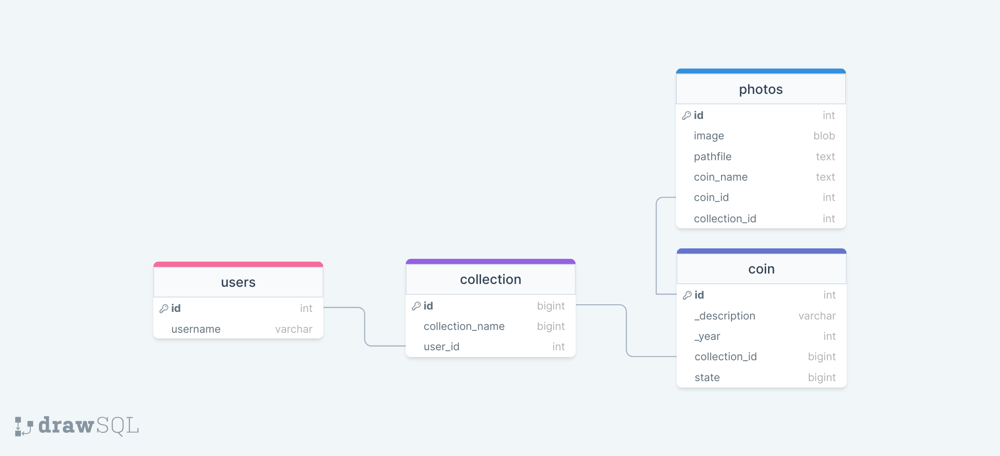

# Дипломный проект
## Студент Бурлаков Валерий
### группа - 3508&3370

## Информация о проекте
* Нужно реализовать систему контроля для личной коллекции монет через телеграм бота

## Задачи
1. Запустить свой сервер.
2. Создать телеграм бота при помощи aiogram.
3. Создать виртуальное окружение для проекта.
4. Создать базу даных MySQL.
* 4.1 Реализовать грамотно таблицы для сущностей.
## UseCase диаграмма
* используется для моделирования и визуализации взаимодействия
между актерами и системой. Она помогает описать основные функции 
системы, её поведение в конкретных сценариях и понять, как система 
будет использоваться в реальной жизни

## Entity-Relationship diagram
* Диаграмма нужна для визуального представления структуры базы данных. 
Она помогает описать сущности (предметы) и связи между ними в БД. 
Позволяет легко понять, какие данные хранит БД, как они связаны 
между собой, а также определить ключевые атрибуты каждой сущности

**CREATE TABLE** users (

    id INT PRIMARY KEY,
    username VARCHAR(255),
    coin_collection TEXT
);

**CREATE TABLE** collection (

    id INT PRIMARY KEY AUTO_INCREMENT,
    user_id INT,
    coin_list JSON,
	FOREIGN KEY*(user_id) REFERENCES users(id)
);

**CREATE TABLE** coin (

	id INT PRIMARY KEY,
    _description VARCHAR(255),
    _year INT
);

**CREATE TABLE** photos (

	id INT PRIMARY KEY AUTO_INCREMENT,
    image BLOB
);

5. связать базу данных MySQL с телеграм ботом.
* pip install mysql-connector-python
6. Реализовать методы для работы бота с базой данных
* Добавление/удаление монет
* вывод коллекции
* отправка коллекции в файле на почту
* показывать примерную стоимость монеты на рынке/аукционе

## Версии
### подключено виртуальное окружение
* mysql-connector-python-8.1.0 protobuf-4.21.12
* python 3.10
* aiogram 2.24